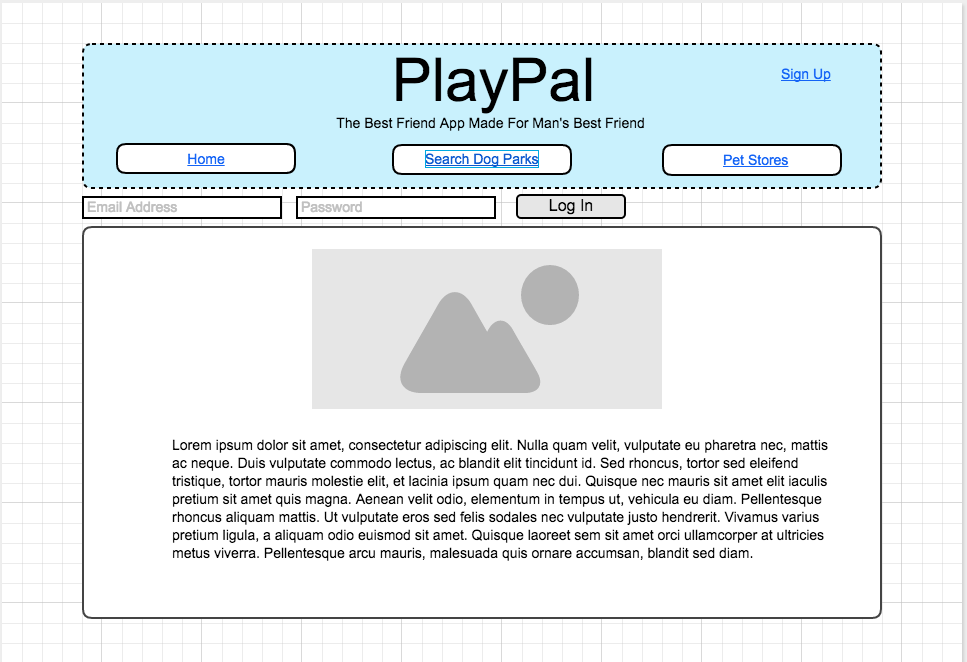
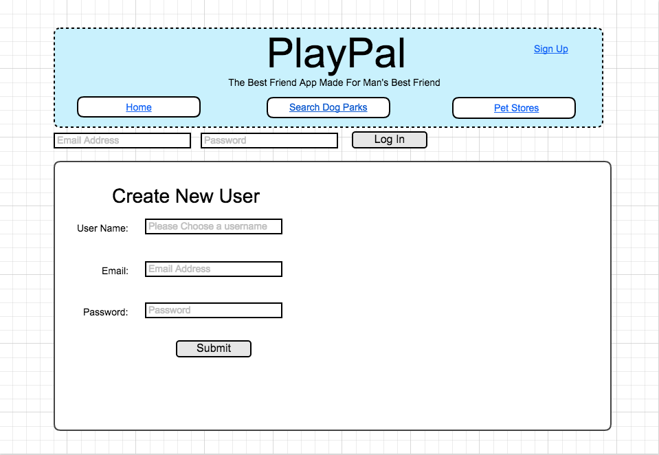
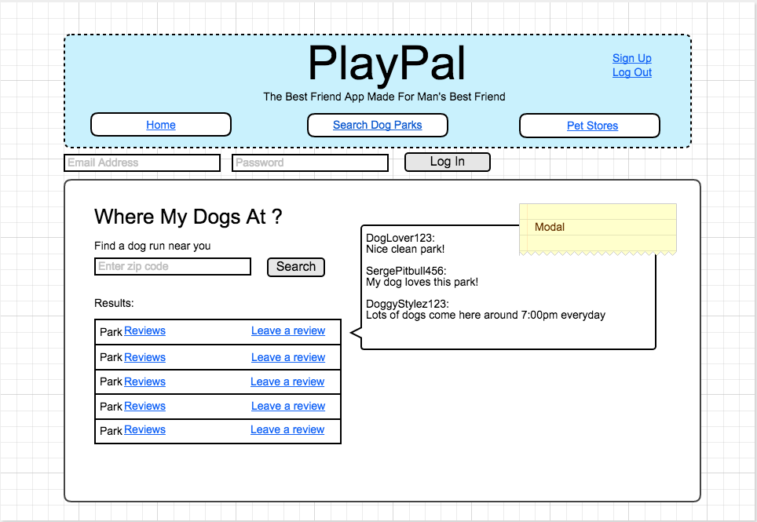
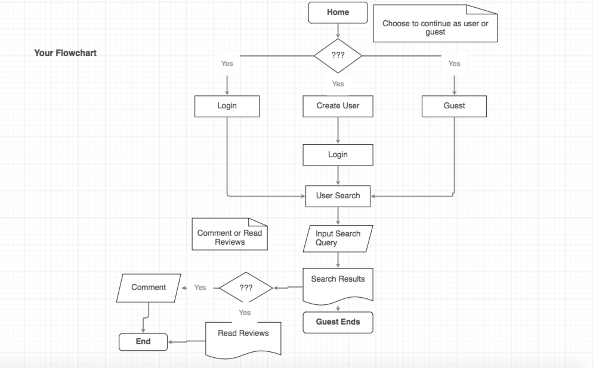

# PlayPal

As a dog owner I'm always looking for a dog park where my dog can have optimal fun.
Yes, there is a dog park near where I live but there's usually 1 or 2 dogs at most there. It's covered in broken glass and there is always dog shit that has not been picked up by their irresponsible owners.

What if there's an undiscovered dog park not too far away? Is it any better than the one I normally go to?
Could it possibly be cleaner? Can I take the leash off my dog? Are there other dogs there?

I present, PlayPal. An app to aid you in giving your dog the most enjoyable activity of the day, each and every day.

PlayPal will allow users to search nearby dog parks and leave comments based on their experience as well as read comments left by other user's experiences. As an added bonus, PlayPal will also be able to show available pet stores nearby just in case you need a toy before you unleash the Kraken.

# Model # 1 - Four Square API
Where My Dogs At?

Use Four Square's API to retrieve data for all NYC dog parks.
https://developer.foursquare.com/start/search 

There will be 2 or 3 search parameters.
Park data will available for all users and guests.
Only users will be able to read and post reviews.
Users will be required to log in to their account in order to leave comments.

# Model # 2 - Yelp API
Dogs-R-Us

Use Yelp's API to retrieve all data for pet stores.
https://www.yelp.com/developers/documentation/v2/search_api

Priveleges for users/guest will be the same as above.
Users/guests will be able to search by zip code, price, and number of stars.
Users will be required to log into their account in order to leave comments.

# Wireframe
Home

Sign Up

Where My Dogs At ?

Flow Chart

